# KaseiCoin on Chain
**KAI (KaseiCoin)** is a new monetary system, the KAI crowdsale is launched through blockchain. KaseiCoin is a fungible token that is ERC-20 compliant. By using this service, customers can convert their money to KaseiCoin.
---
---

Content incudes:

* [Technologies](#technologies)

* [App Development](#app-development)

* [App Demo](#app-demo)

* [Contributors](#contributors)

---

## Technologies
>This project leverages python 3.7

* [Solidity](https://docs.soliditylang.org/en/v0.8.15/) - object-oriented, high-level language for implementing smart contracts

* [Remix IDE](https://remix.ethereum.org/) - allows developing, deploying and administering smart contracts for Ethereum like blockchains. It can also be used as a learning platform

* [OpenZeppelin](https://www.openzeppelin.com/) - provides seurity products to build, automate, and operate decentralized applications.

---

## App Development
* Created KaseiCoin.sol
    * Imported ERC20, ERC20Detailed, and ERC20Mintable from OpenZeppelin
    * Built KaseiCoin contract with constructor
    * Compiled the contract

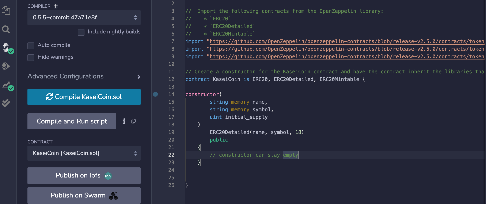

* Created KaseiCoinCrowdsale.sol
    * Inported KaseiCoin.sol, Crowdsale, MintedCrowdsale, CappedCrowdsale, TimedCrowdsale, and RefundablePostDeliveryCrowdsale
    * Built KaseiCoinCrowdsale contract with constructor
    * Compiled the contract 
    * Built KaseiCoinCrowdsaleDeployer contract with constructor
    * Compiled the contract

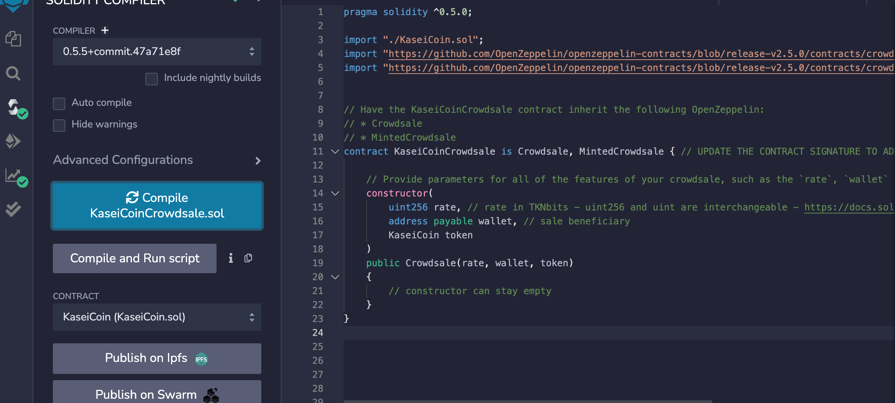

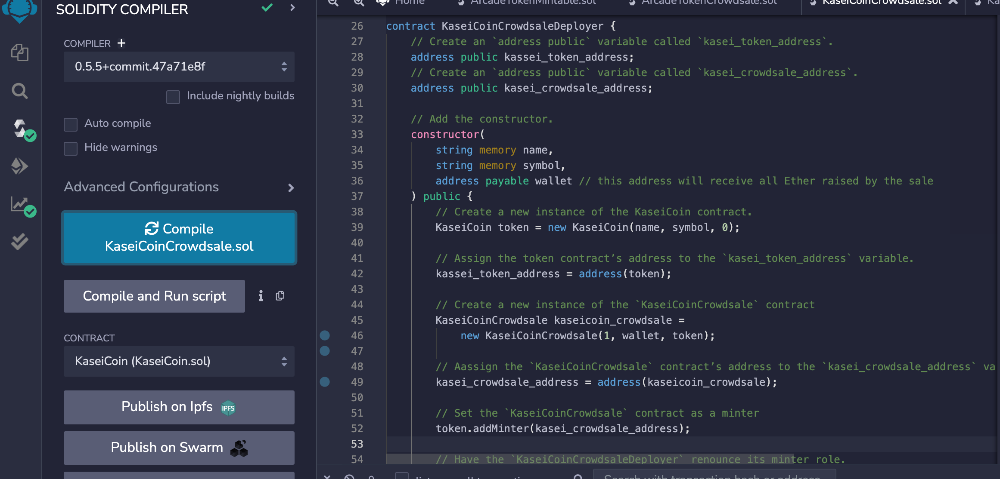

## * **Deploy the KaseiCoinCrowdsaleDeployer contract on MetaMask with specified name, symbol, and address**

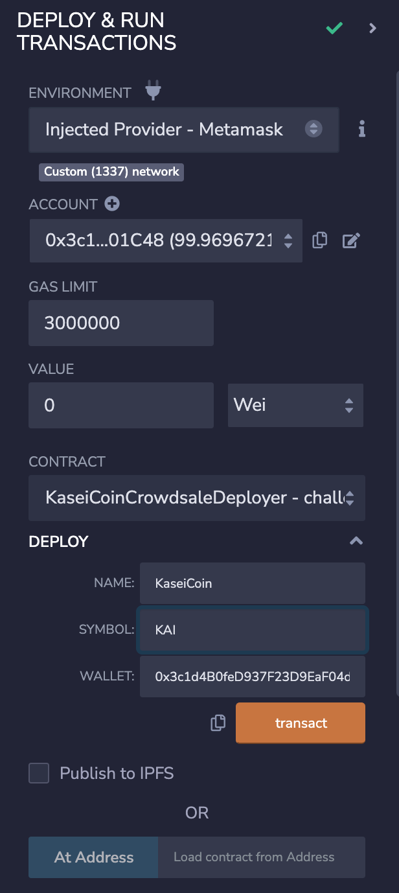

## * **Confirm deployment with MetaMask**

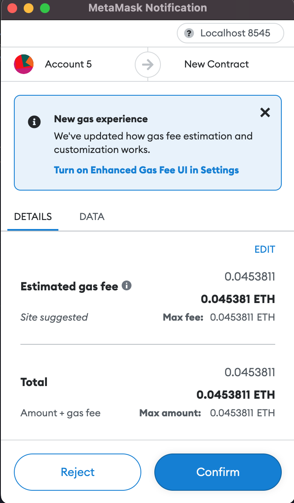

## * **Deploy the KaseiCoinCrowdsale contract with provided address and it provides functions described in the contract**

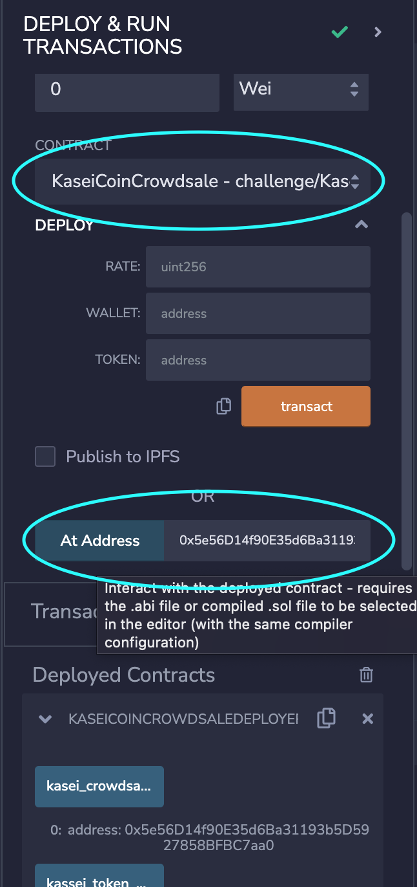

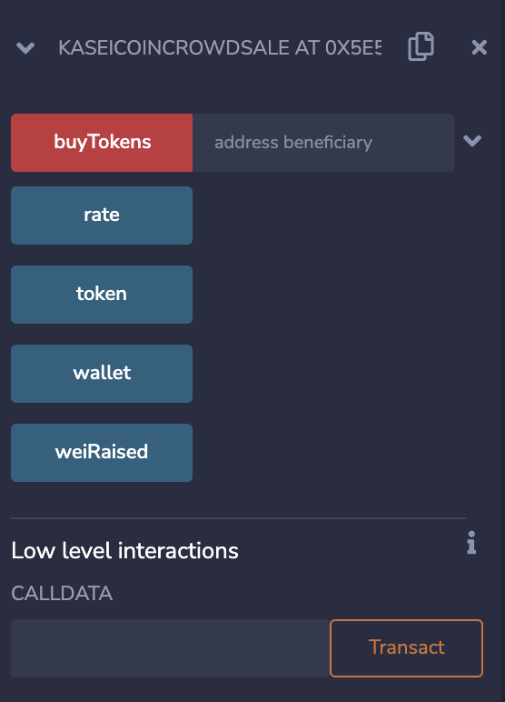

## * **Deploy the KaseiCoin contract with provided address and it provides functions described in the contract**

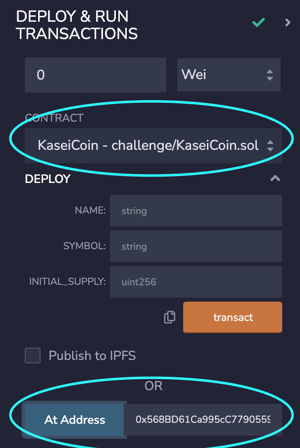

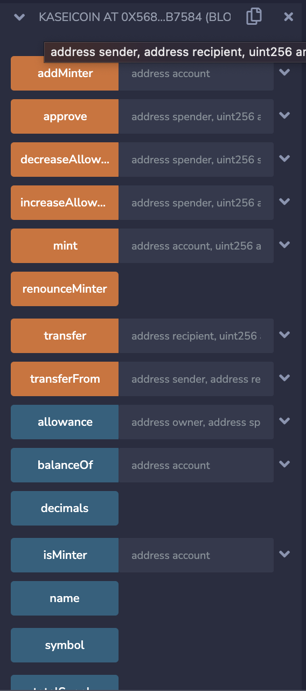

---

## App Demo

### Test the App by purchasing tokens with 2 test accounts, then display the total supply of minted tokens and the amount of wei that has been raised in the crowdsale contract. 

## Step1: Specify the number of KAI trying to puchase

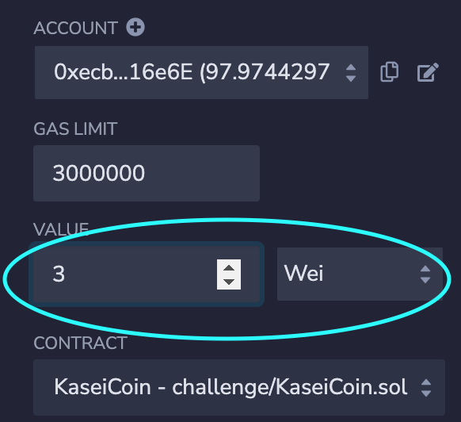

## Step2: Put in the account address of the user trying to purchase KAI and press `buyTokens`

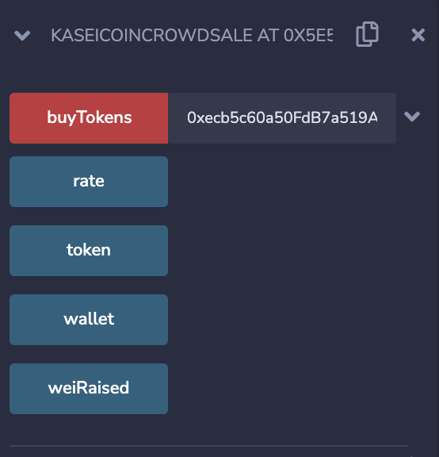

## Step3: Confirm the purchase on MetaMask

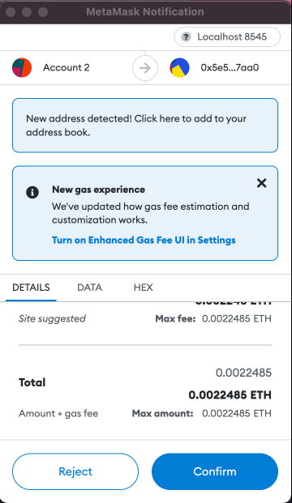

## Step4: Check the amount of tokens has been sold by clicking `weiRaised`

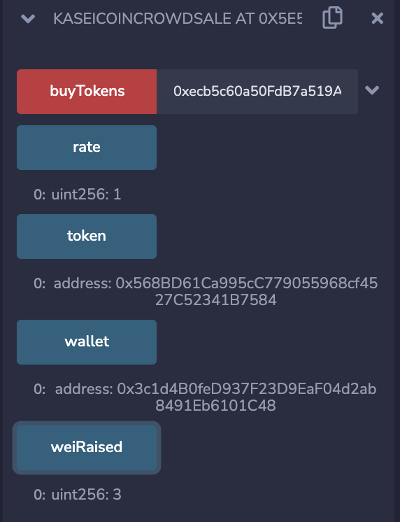

## Step5: Check the amount of tokens has been minted by clicking `totalSupply`

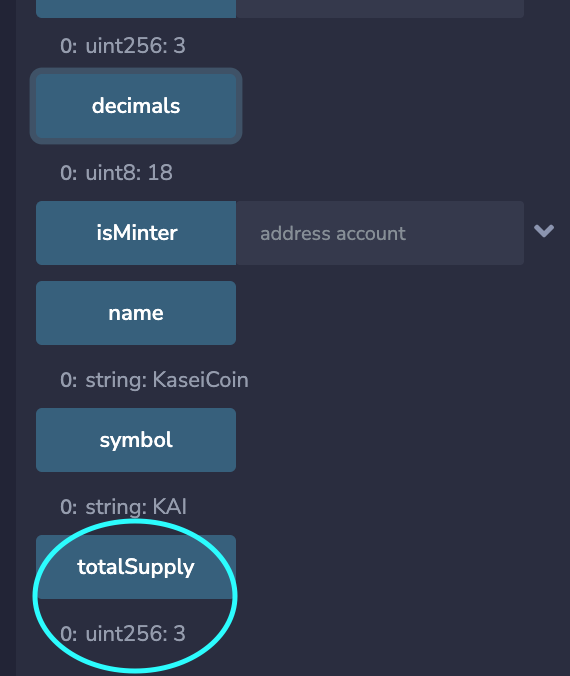

## Step6: Repeat Step1 - Step5 and confirm total tokens sold and minted

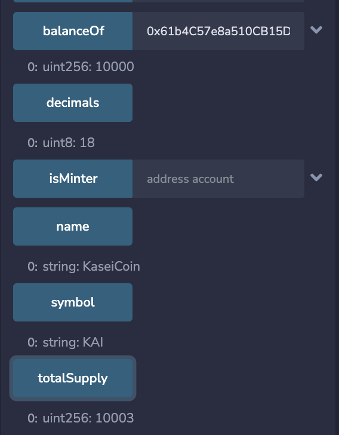

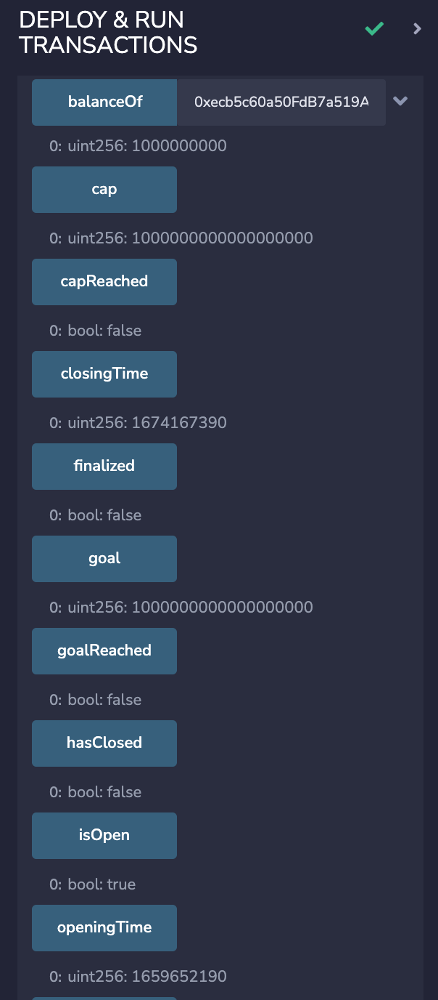

---

## Contributors

**Yanjun Lin Andrie** &nbsp;&nbsp; |
&nbsp;&nbsp; email: yanjun.lin.andrie@gmail.com &nbsp;&nbsp;|
&nbsp;&nbsp; 

**UC Berkeley Extension**

---

## License

---

## Evaluation Evidence

